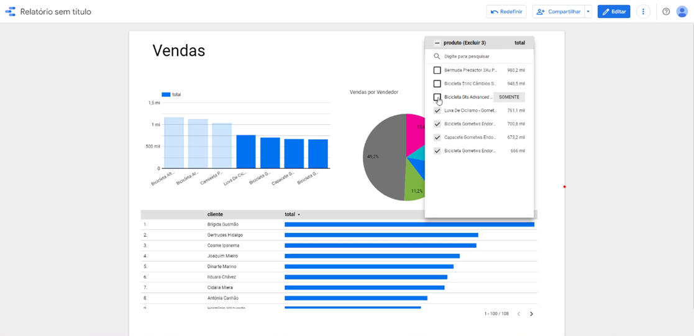

# 🏗️ Cloud Data Warehouse — Amazon Redshift Serverless + Looker Studio

> End-to-end Data Warehouse implementation on AWS, combining Redshift Serverless, S3 data lake, dimensional modeling, and a live analytical dashboard on Google Looker Studio.


---

## 📐 Architecture Overview

```
┌─────────────────────────────────────────────────────────────────┐
│                        DATA SOURCES                             │
│           CSV Files (clientes, produtos, vendas,                │
│                vendedores, itensvenda)                          │
└─────────────────────┬───────────────────────────────────────────┘
                      │
                      ▼
┌─────────────────────────────────────────────────────────────────┐
│                     STORAGE LAYER                               │
│                    Amazon S3 Bucket                             │
│              (Raw files — Landing Zone)                         │
└─────────────────────┬───────────────────────────────────────────┘
                      │  COPY Command
                      ▼
┌─────────────────────────────────────────────────────────────────┐
│                   PROCESSING LAYER                              │
│            Amazon Redshift Serverless                           │
│         Namespace: de-namespace | Workgroup: de-workgroup       │
│                   4 RPUs | sa-east-1                            │
│                                                                 │
│   ┌─────────────────┐         ┌──────────────────────────┐      │
│   │  STAGING TABLES │  ──►    │   ANALYTICAL LAYER       │      │
│   │  - clientes     │         │   fatovendas             │      │
│   │  - produtos     │         │   (denormalized fact     │      │
│   │  - vendas       │         │    table — Star Schema)  │      │
│   │  - vendedores   │         └──────────────────────────┘      │
│   │  - itensvenda   │                                           │
│   └─────────────────┘                                           │
└─────────────────────┬───────────────────────────────────────────┘
                      │  PostgreSQL Native Connector
                      ▼
┌─────────────────────────────────────────────────────────────────┐
│                  VISUALIZATION LAYER                            │
│               Google Looker Studio                              │
│         Ad hoc Dashboard — Vendas, Produtos, Clientes           │
└─────────────────────────────────────────────────────────────────┘
```

---

## 🔑 Key Engineering Decisions

### 1. Redshift Serverless over Provisioned Cluster
Adopted Redshift Serverless (4 RPUs) instead of a traditional provisioned cluster to eliminate infrastructure management overhead, enable automatic scaling to zero during idle periods, and minimize cost — paying only for actual query execution time.

### 2. S3 as Landing Zone + COPY Command
Raw CSV files are staged in S3 before being loaded into Redshift using the native `COPY` command — the recommended pattern for high-throughput bulk ingestion, significantly more efficient than row-by-row inserts.

### 3. Denormalized Fact Table (fatovendas)
Rather than querying across five normalized tables at runtime, a denormalized fact table (`fatovendas`) was materialized via `SELECT INTO`, joining clientes, vendedores, produtos, vendas, and itensvenda. This pattern reduces query complexity and improves dashboard performance for analytical workloads.

### 4. PostgreSQL Native Connector for Looker Studio
The native Redshift connector in Looker Studio has a known SSL handshake incompatibility with Redshift Serverless endpoints. The PostgreSQL JDBC driver handles the dynamic endpoint routing of Redshift Serverless more reliably, bypassing the certificate negotiation that causes the native connector to stall silently.

```
# Connection that works:
Host:     <workgroup>.<account>.sa-east-1.redshift-serverless.amazonaws.com
Port:     5439
Database: <your-db>
SSL:      optional
Connector: PostgreSQL (not native Redshift)
```

---

## 📁 Repository Structure

```
data-engineering-aws-redshift-dw/
│
├── data-s3/                        # Raw source files (S3 upload)
│   ├── clientes.csv
│   ├── itensvenda.csv
│   ├── produtos.csv
│   ├── vendas.csv
│   └── vendedores.csv
│
├── scripts/                        # SQL execution sequence
│   ├── 00.Create-DataBase.sql      # Database provisioning
│   ├── 01.CreateTable.sql          # DDL — staging tables
│   ├── 02.copy-vendedores.sql      # COPY ingestion
│   ├── 03.copy-produtos.sql
│   ├── 04.copy-clientes.sql
│   ├── 05.copy-vendas.sql
│   ├── 06.copy-itensvenda.sql
│   └── 07.fatovendas.sql           # Fact table — denormalized
│
├── docs/
│   ├── architecture/
│   │   └── redshift-postgres-connector-ssl-fix.png  # Fixing the SSL connection error with the native PostgreSQL connector.
│   └── screenshots/
│       ├── dashboard-looker-studio.png
│       ├── redshift-workgroup-config.pdf
│       ├── security-group-inbound-rules.pdf
│       └── vpc-resource-map.pdf
│
└── README.md
```

---

## 🚀 Execution Sequence

### Prerequisites
- AWS account with Redshift Serverless provisioned
- S3 bucket created in the same region (`sa-east-1`)
- IAM Role with `AmazonRedshiftAllCommandsFullAccess` attached to the namespace
- AWS credentials configured

### Step-by-step

```sql
-- 1. Create the target database
-- scripts/00.Create-DataBase.sql

-- 2. Create staging tables (Star Schema dimensions)
-- scripts/01.CreateTable.sql

-- 3. Upload CSV files to S3
-- aws s3 cp data-s3/ s3://<your-bucket>/data/ --recursive

-- 4. Load data via COPY command (execute in sequence)
-- scripts/02.copy-vendedores.sql
-- scripts/03.copy-produtos.sql
-- scripts/04.copy-clientes.sql
-- scripts/05.copy-vendas.sql
-- scripts/06.copy-itensvenda.sql

-- 5. Materialize fact table
-- scripts/07.fatovendas.sql

-- 6. Connect Looker Studio using PostgreSQL native connector
```

---

## 🔐 AWS Infrastructure Configuration

### Redshift Serverless Workgroup
| Parameter | Value |
|-----------|-------|
| Workgroup | `de-workgroup` |
| Namespace | `de-namespace` |
| Base capacity | 4 RPUs |
| Region | `sa-east-1` |
| Publicly accessible | Enabled (for Looker Studio) |
| SSL | Enabled |

### Security Group Inbound Rules (port 5439)
| Source | Description |
|--------|-------------|
| `142.251.56.0/24` | Looker Studio IPv4-2 |
| `74.125.0.0/16` | Looker Studio IPv4-3 |
| `142.251.74.0/23` | Looker Studio IPv4-4 |
| `2001:4860:4807::/48` | Looker Studio IPv6 |

> ⚠️ **Security note:** Remove inbound rules and disable public access when not actively using Looker Studio. Redshift Serverless idles at zero cost, but exposed endpoints are a security risk.

---

## 📊 Dashboard Output

Built on Google Looker Studio connected to the `fatovendas` fact table:

- **Sales by product** — bar chart with filter by product exclusion
- **Sales by vendor** — pie chart with percentage breakdown
- **Top customers by revenue** — ranked bar table



---

## 🧠 Lessons Learned

- **Redshift Serverless ≠ Redshift Cluster** for external connectivity: public endpoint configuration requires explicit subnet routing via Internet Gateway, not just the "publicly accessible" flag.
- **Driver matters more than network**: a fully correct AWS infrastructure setup still fails if the BI tool uses the wrong JDBC driver. Always test with the PostgreSQL connector when native connectors fail silently against serverless endpoints.
- **IAM Role is non-negotiable**: COPY and UNLOAD commands are blocked without an attached IAM role — even with correct credentials and network access.

---

## 🔗 Related Resources

- [Amazon Redshift Serverless — Connecting externally](https://docs.aws.amazon.com/redshift/latest/mgmt/serverless-connecting.html)
- [Looker Studio — Amazon Redshift connector](https://support.google.com/looker-studio/answer/10715734)
- [AWS COPY command reference](https://docs.aws.amazon.com/redshift/latest/dg/r_COPY.html)

---

*Part of [Data Engineering Portfolio](../README.md) — Heuler Silva*
